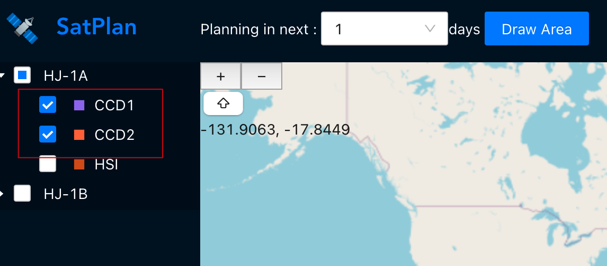
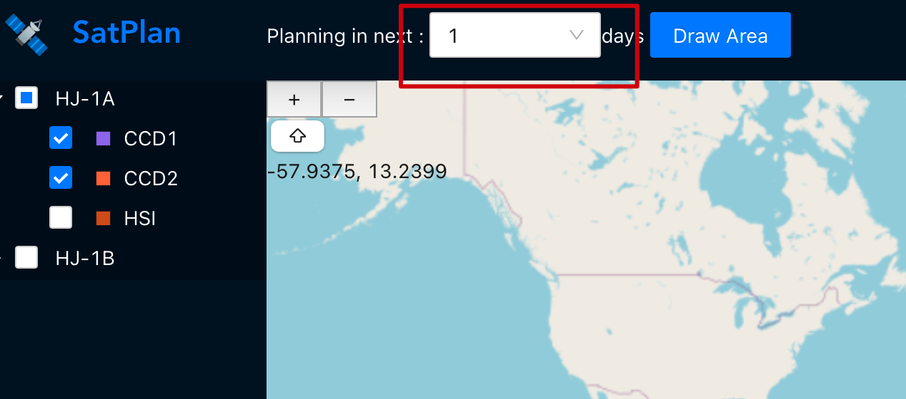
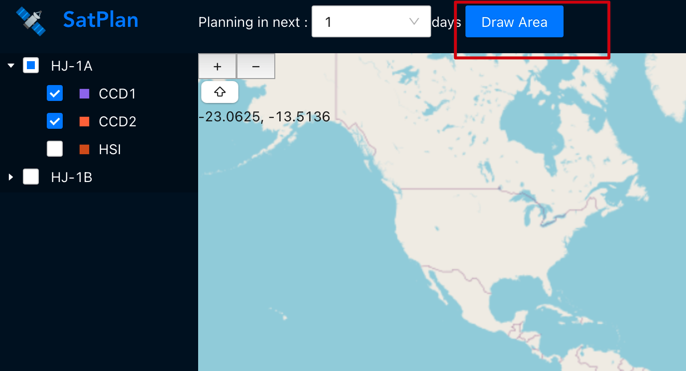
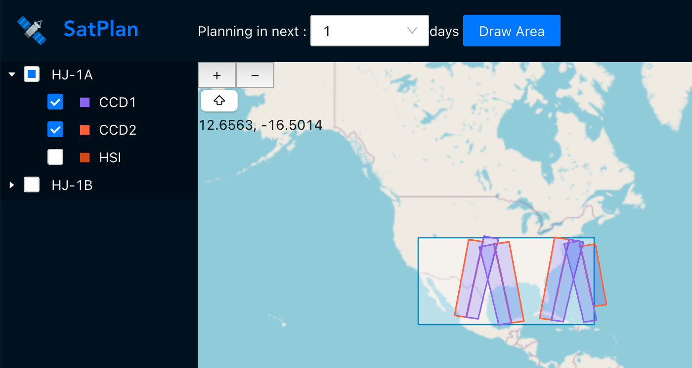
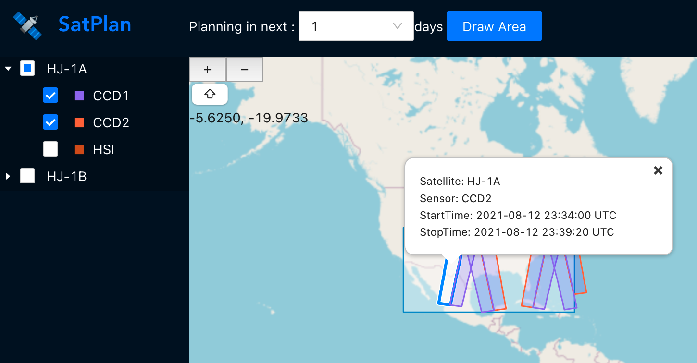

# Satplan-web
Satplan-web is a frontend application developed in typescript, used to visualize satellite mission planning.  It should work with [satplan-server](https://github.com/figwh/satplan-server). The following techniques are used:
* react
* antd pro
* openlayers

## Usage
### Select sensors
Select sensors on satellite tree


### Define planning time span
Select planning time span, which is several days from now.


### Define interest area
Click "Draw Area" button and draw rectangle on map.


That's it, the result will be displayed immediately.


Click a path on map, details will be displayed.


## Build and run
### Prerequisites
Make sure you have installed all of the following prerequisites on your development machine:
* node.js v12.21.0+
* yarn 1.22.11+

Run ```yarn && yarn start``` to start, will show at http://localhost:8000